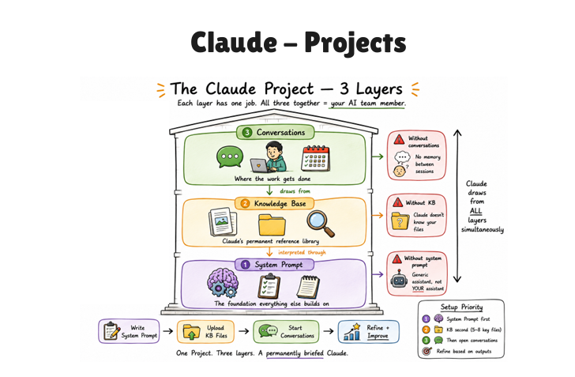

# Claude Projects — Complete Guide (Telugu-English Mix)

> **Idi enti?** Claude Projects ante oka dedicated workspace laga. Oka project ki related instructions,
> knowledge files, and conversations ni one place lo organize cheyyadaniki use chestam.

---

## Visual Summary: Claude Project — 3 Layers



**Simple Telugu-English explanation:**

Ee image lo Claude Project ni **3 layers** laga explain chesaru. Oka project lo Claude better ga work cheyyali ante
ee 3 layers together ga use avvali:

1. **System Prompt**
2. **Knowledge Base**
3. **Conversations**

Simple ga cheppali ante:

```text
System Prompt = Claude ela behave avvali ani rules
Knowledge Base = Claude ki permanent reference files
Conversations = Actual work/discussion jarige place
```

---

## Architecture Diagram

```text
[Project Goal]
      |
      v
[System Prompt: rules + role + style]
      |
      v
[Knowledge Base: docs + examples + files]
      |
      v
[Conversations: daily tasks + questions + outputs]
      |
      v
[Better, consistent, project-aware Claude responses]
```

---

## Deep Architecture Notes

- **Step 1:** First system prompt set chestam. Idi Claude ki foundation instructions istundi.
- **Step 2:** Taruvata knowledge base files add chestam. Idi Claude ki project-specific reference material istundi.
- **Step 3:** Taruvata conversations start chestam. Ikkada actual task execution jarugutundi.
- **Step 4:** Claude response ivvadappudu ee three layers ni kalipi consider chestundi.
- **Step 5:** Outputs chusi instructions/files improve chesthe project quality gradually better avtundi.

---

## Layer 1: System Prompt

**System Prompt ante enti?**

System prompt ante Claude ki project-level permanent instructions. Example:

- Nee role enti?
- Ee project lo tone ela undali?
- Output format ela undali?
- Emi cheyyali, emi cheyyakudadhu?

**Image lo meaning:**

System Prompt ni bottom layer ga chupincharu because adi foundation. Building ki base strong ga undali kada,
same laga Claude Project lo system prompt strong ga unte responses consistent ga vastayi.

**Example:**

```text
You are helping a software engineer who works on Playwright and Cypress automation.
Explain answers in simple Telugu-English mix.
Use practical examples and avoid unnecessary theory.
```

**Why important?**

System prompt lekunda Claude generic assistant laga respond chestundi. System prompt unte Claude project ki
fit ayye assistant laga behave chestundi.

---

## Layer 2: Knowledge Base

**Knowledge Base ante enti?**

Knowledge Base ante project ki related files/docs/examples. Claude project lo upload chese reference material.

Examples:

- Requirements docs
- Coding standards
- Test automation patterns
- Existing examples
- API docs
- Product notes
- Learning notes

**Image lo meaning:**

Knowledge Base middle layer lo undi. System prompt foundation istundi, knowledge base detailed information istundi.
Claude answer generate cheyyadaniki ee files nundi context teesukuntundi.

**Why important?**

Prati sari same context re-explain cheyyalsina avasaram taggutundi. Once files add chesthe Claude repeated ga
reference chesukogaladu.

**Example for your role:**

Software engineer working Playwright/Cypress automation kabatti knowledge base lo ila files pettachu:

- `playwright-test-patterns.md`
- `cypress-test-patterns.md`
- `page-object-model-guidelines.md`
- `test-data-guidelines.md`
- `automation-review-checklist.md`

**Simple meaning:**

Knowledge Base = Claude ki "project memory library".

---

## Layer 3: Conversations

**Conversations ante enti?**

Conversations ante actual chat sessions. Ikkada manam Claude ni tasks adugutam:

- Test case create cheyyi
- Bug fix cheyyi
- Code explain cheyyi
- Notebook content add cheyyi
- Skill documentation update cheyyi

**Image lo meaning:**

Conversations top layer lo chupincharu because final work ikkada jarugutundi. But conversations better ga work
avvali ante bottom two layers — System Prompt and Knowledge Base — strong ga undali.

**Why important?**

Conversation lo manam task-specific input istam. Claude already system prompt + knowledge base nundi background
context teesukoni better answer istundi.

---

## What happens without each layer?

Image right side lo warning boxes unnayi. Avi cheppedi:

| Missing Layer | Problem |
|---|---|
| Without conversations | Actual work jaragadu; sessions madhya memory/use continuity undadu |
| Without knowledge base | Claude ki mee project files/docs teliyavu |
| Without system prompt | Claude generic assistant laga behave chestundi |

**Simple explanation:**

- System prompt lekapothe: Claude ki role/style clear kaadu.
- Knowledge base lekapothe: Claude ki project details teliyavu.
- Conversations lekapothe: Task execution jaragadu.

---

## Setup Priority

Image lo setup priority ila undi:

1. **System Prompt first**
2. **Knowledge Base second**
3. **Conversations third**
4. **Refine based on outputs**

### 1. System Prompt first

Mundhu Claude ki permanent instructions ivvali.

Example:

```text
Use simple Telugu-English mix.
For code, explain what and why.
For Playwright/Cypress, follow existing repo patterns.
```

### 2. Knowledge Base second

Taruvata project docs/files add cheyyali.

Example:

```text
automation-guidelines.md
coding-style.md
project-context.md
```

### 3. Start conversations

Now actual work start cheyyachu.

Example:

```text
Create Playwright test for login flow.
Explain this ML notebook code line by line.
Add this image into my docs with explanation.
```

### 4. Refine based on outputs

Claude output lo repeated mistakes kanipisthe, system prompt or knowledge base update cheyyali.

Example:

```text
If Claude keeps giving too much theory, add: "Keep explanations practical and beginner-friendly."
```

---

## Claude Projects vs Normal Chat

| Normal Chat | Claude Project |
|---|---|
| Context mostly current chat lo matrame untundi | Project-level instructions and files available untayi |
| Prati sari background repeat cheyyali | Same context re-use cheyyachu |
| Output style vary avvachu | Output style consistent ga untundi |
| Small one-time tasks ki best | Long-term project work ki best |

---

## Your Use Case

Mee role: **Software engineer working Playwright and Cypress test automation, and AI learner**.

Mee Claude Project lo system prompt ila undachu:

```text
I am a software engineer working on Playwright and Cypress test automation and I am also learning AI/ML.
Explain concepts in simple Telugu-English mix.
For code, include what each line does and why we are doing it.
For automation tasks, inspect existing project structure and follow existing patterns.
For notebooks/docs, use beginner-friendly explanations with examples.
```

Mee knowledge base lo pettachu:

- Playwright repo testing patterns
- Cypress repo testing patterns
- AI learning notebook style rules
- Telugu-English explanation format
- Common commands for npm/test execution
- Skill writing blueprint

---

## Quick Summary

- **Claude Project** = one organized workspace for one goal/project.
- **System Prompt** = Claude behavior rules and style.
- **Knowledge Base** = Claude ki project reference files.
- **Conversations** = actual task execution chats.
- **Best order:** System Prompt -> Knowledge Base -> Conversations -> Refine.
- **Main benefit:** Same context repeated ga explain cheyyalsina avasaram taggutundi.