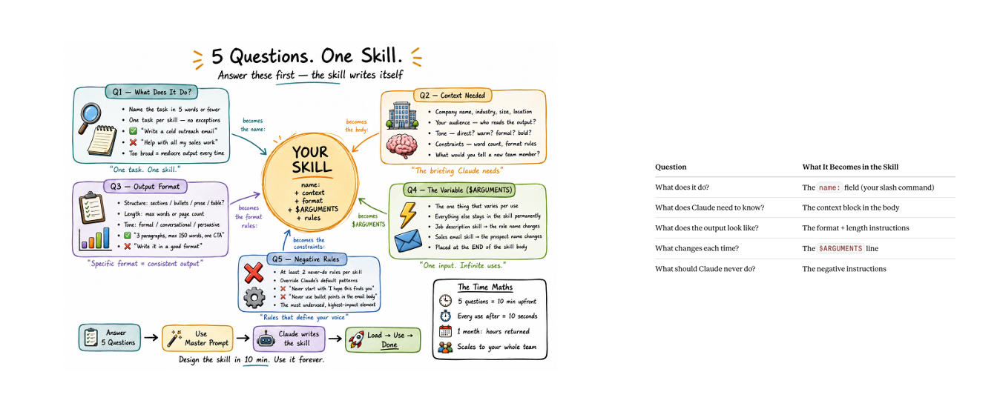
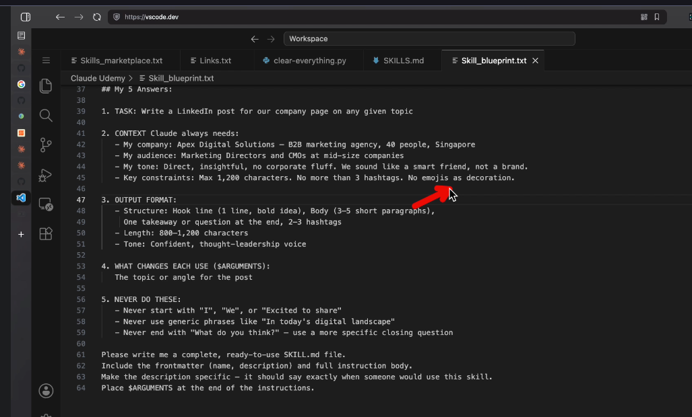

# Claude Skills — Complete Guide (Telugu-English Mix)

> **Idi enti?** — Ee document lo Claude Skills ante enti, adi apps lo (Claude.ai, Claude Code, Claude API) ela
> work avutundo, and easy ga understand cheyadaniki oka real-world analogy — anni step-by-step detailed ga
> explain chesam.

---

## Visual Summary: 5 Questions, One Skill



**Simple Telugu-English explanation:**

Ee image cheppedi enti ante, oka good Claude Skill create cheyyali ante mundu **5 questions** ki answer ivvali.
Aa answers base meeda `SKILL.md` file clear ga design cheyyachu.

### Q1 — What does it do?

Idi skill main job enti ani chepthundi. Task name short ga, clear ga undali.
Example: "PDF summarize cheyyi", "resume review cheyyi", "SQL query generate cheyyi".

**Why important?** Claude skill ni select cheyyadaniki first `name` and `description` chustundi. Skill purpose unclear ga unte Claude wrong time lo use cheyyachu leda use cheyyakapovachu.

### Q2 — Context needed

Claude ki task complete cheyyadaniki required background details enti?
Example: company name, audience, tone, format, constraints, examples.

**Why important?** Context lekapothe output generic ga vastundi. Context unte output user situation ki match avtundi.

### Q3 — Output format

Final answer ela undali ani define cheyyali.
Example: sections, bullets, table, JSON, short answer, detailed answer.

**Why important?** Output format fixed ga unte every time consistent result vastundi. Team lo andariki same style lo output dorukutundi.

### Q4 — Variable / `$ARGUMENTS`

Prati use lo change ayye input ni `$ARGUMENTS` laga treat cheyyali.
Example: customer name, file path, topic name, selected text.

**Why important?** Skill reusable avtundi. One skill ni different inputs tho multiple times use cheyyachu.

### Q5 — Negative rules

Skill em cheyyakudadhu ani rules define cheyyali.
Example: "Never invent facts", "Do not change code without asking", "Do not reveal secrets".

**Why important?** Negative rules output ni safe ga and controlled ga keep chestayi.

### Image table meaning

| Question | Skill lo em avtundi? |
|---|---|
| What does it do? | Skill `name` and slash command laga use ayye identity |
| What does Claude need to know? | Skill body lo context/instructions |
| What does output look like? | Format and length rules |
| What changes each time? | `$ARGUMENTS` line |
| What should Claude never do? | Negative instructions |

**Final idea:** 5 questions answer cheste skill design almost complete avtundi. Taruvata Claude aa information ni `SKILL.md` structure lo convert chesi reusable skill laga use cheyyagaladu.

### Example Blueprint: My 5 Answers



**Simple Telugu-English explanation:**

Ee image lo `Skill_blueprint.txt` example chupistundi. Idi oka skill create cheyyadaniki mundu fill cheyyalsina
rough planning document laga use avtundi. Ikkada example task: **LinkedIn company page post write cheyyadam**.

#### 1. TASK

`Write a LinkedIn post for our company page on any given topic`

Idi skill main job ni define chestundi. Ante ee skill use chesinappudu Claude LinkedIn post create cheyyali.

**Why important?** Task clear ga unte Claude ki "ee skill exact ga em cheyyali?" ani confusion undadu.

#### 2. CONTEXT Claude always needs

Image lo company, audience, tone, and constraints mention chesaru:

- Company: Apex Digital Solutions
- Audience: Marketing Directors and CMOs
- Tone: Direct, insightful, no corporate fluff
- Constraints: Max 1,200 characters, no more than 3 hashtags, emojis decoration laga use cheyyakudadhu

**Meaning:** Ee details fixed context. Prati LinkedIn post lo company voice and audience same ga undali kabatti skill instructions lo permanent ga pettali.

**Why important?** Context lekapothe Claude generic LinkedIn post rayachu. Context unte post company brand ki match avtundi.

#### 3. OUTPUT FORMAT

Image lo post structure clear ga define chesaru:

- Hook line
- Body with 3 to 5 short paragraphs
- One takeaway/question at end
- 2 to 3 hashtags
- Length: 800 to 1,200 characters
- Tone: Confident thought-leadership voice

**Meaning:** Output ela kanipinchali ani exact format chepthundi.

**Why important?** Format define chesthe every time same quality and same structure lo output vastundi.

#### 4. WHAT CHANGES EACH USE (`$ARGUMENTS`)

Image lo `$ARGUMENTS` ante:

`The topic or angle for the post`

**Meaning:** Prati sari user topic different ga istadu. Example: "AI in marketing", "B2B lead generation", "brand trust".
Aa changing input ni `$ARGUMENTS` place lo Claude use chestundi.

**Why important?** Skill reusable avtundi. Same skill multiple topics ki use cheyyachu.

#### 5. NEVER DO THESE

Image lo negative rules:

- Never start with generic words like "I", "We", "Excited to share"
- Never use generic phrases like "In today's digital landscape"
- Never end with generic question like "What do you think?"

**Meaning:** Claude avoid cheyyalsina writing patterns ni clear ga chepthundi.

**Why important?** Negative rules valla boring/generic AI-style writing reduce avtundi. Output more specific and professional ga untundi.

#### Final prompt at bottom

Image bottom lo:

`Please write me a complete, ready-to-use SKILL.md file...`

Idi Claude ki final instruction. Ante above 5 answers base meeda complete `SKILL.md` generate cheyyamani asking.

**Simple flow:** 5 answers fill cheyyi -> Claude ki prompt ivvu -> Claude ready-to-use `SKILL.md` generate chestundi -> skill folder lo save chesi use cheyyachu.

---

## Architecture Diagram

```
[User Request]
       |
       v
[Claude checks all installed Skills — name + description matram (~100 tokens each)]
       |
   Matches a skill's description?
       |
      Yes                          No
       |                            |
       v                            v
[Load full SKILL.md instructions]  [Normal Claude response —
       |                             no skill needed]
       v
[Follow step-by-step instructions in SKILL.md]
       |
   Needs extra files? (scripts/references/assets)
       |
      Yes -----------> [Load only that specific file, on demand]
       |
       v
[Execute scripts / use templates / apply domain knowledge]
       |
       v
[Final Output to User]
```

---

## Deep Architecture Notes

- **Step 1:** Claude startup lo, install chesina prathi skill nunchi kevalam `name` and `description` matrame load chestundi — chala light weight (~100 tokens per skill).
- **Step 2:** User request vachinappudu, Claude aa descriptions ni scan chesi, "ee task ki e skill match avutundo" ani decide chestundi. Idi **discovery** step.
- **Step 3:** Match aithe, aa skill ki chendina full `SKILL.md` file ni completely load chestundi — ippudu detailed instructions Claude ki available avutayi.
- **Step 4:** Skill ki additional files (scripts, references, assets) unte, avi **avasaram unnappudu matrame** load chestundi — idi **progressive disclosure** ane technique, context window ni waste cheyakunda.
- **Step 5:** Final ga, Claude aa instructions follow chesi, scripts run chesi leda templates use chesi, user ki output istundi.

---

# PART 1: Skill ante enti? (Concept)

**Simple definition:**
Skill ante Claude ki icche oka **reusable instruction package** — "ee type task vaste, ee steps follow cheyyi" ani
cheppe folder. Idi prompt kaadu, oka **pre-packaged expertise module**.

**Skill lo em untundi?**

```
my-skill/
├── SKILL.md              <- required: instructions + metadata
├── scripts/               <- optional: python/bash code Claude run cheyachu
│   └── main.py
├── references/            <- optional: extra docs, on-demand load avutayi
│   └── workflow.md
└── assets/                 <- optional: templates, fonts, icons
    └── template.html
```

**SKILL.md structure (2 parts):**

1. **YAML Frontmatter** (top lo, `---` madhya) — required fields:
   - `name` — skill ki unique identifier
   - `description` — ee skill em chestundi, eppudu use avvali ani cheppe text. Idi discovery ki chala important —
     Claude ee description chusi matter decide chestundi.

   ```yaml
   ---
   name: pdf-processing
   description: Extracts text, tables, and forms from PDF files. Use when user
     uploads a PDF or asks to read/summarize/fill a PDF document.
   ---
   ```

2. **Markdown Instructions** (frontmatter kinda) — actual step-by-step guidance, Claude follow cheyyalsina
   procedure. Chinna ga, focused ga undali (500 lines lopu recommend chestaru), ekkuva unte references/ folder ki
   move cheyyali.

**Skill vs normal prompt — key difference:**

| Normal Prompt | Skill |
|---|---|
| Prathi sari manually type cheyali | Oka sari create chesi, permanent ga reuse |
| Context motham okate turn lo | Progressive disclosure — avasaram unnapude load |
| No scripts/files attach avvavu | Scripts, templates, references attach avvachu |
| Session-specific | Reusable across sessions/projects/team |

---

# PART 2: Skills in Apps — Ekkada Ekkada Work Avutayi

Skills ee okka tool ki matrame kaadu — Claude ecosystem motham lo (Chat, Code, API) use avutayi, kaani prathi
chotu slight ga different ga configure avutundi.

## 2.1 Claude.ai (Chat / Web App)

- Settings lo "Skills" section undi, meeru Anthropic pre-built skills (Excel, PDF, Word, PowerPoint processing
  lanti vi) ni enable cheyachu, leda custom skills upload cheyachu.
- Conversation madhyalo, meeru file upload chesinappudu leda specific keyword vaadinappudu, matching skill
  automatic ga activate avutundi — meeru manually select cheyalsina avasaram ledu.
- Example: "ee Excel file lo pivot table create cheyyi" ani meeru type cheste, Excel skill automatic ga
  trigger avutundi, appropriate code/logic run chestundi.

## 2.2 Claude Code (Terminal / IDE Agent)

- Ikkada skills `.claude/skills/` (project-level) leda global config lo (`~/.claude/skills/`) folders ga
  store avutayi.
- Claude Code prathi task ki relevant skill ni automatic ga discover chesi load chestundi — mana ee repo
  (`c:\learnAi`) lo unna [customize-cloud-agent], [github-pr-media] lanti skills ivi ee pattern follow
  avutayi.
- Team motham share cheskovachu — oka developer create chesina skill, repo lo commit chesthe, migatha team
  members andariki automatic ga available avutundi.

## 2.3 Claude API / Platform (Developers)

- Messages API dwara, developers programmatic ga skills ni attach cheyachu (`container` parameter tho, code
  execution tool enable chesi).
- Versioning support untundi — skill ni update chesina, old version backward-compatible ga migilipotundi.
- Enterprise lo, skills ni GitHub repo nunchi mount cheyachu, central ga manage cheyachu (AWS, Microsoft
  Foundry platforms lo kuda ide model).

## 2.4 Common Thread — Anni Apps Lo Same Pattern

```
[App: Chat / Code / API]
        |
        v
[Skill Discovery — description scan]
        |
        v
[Skill Activation — full instructions load]
        |
        v
[Task Execution — with domain expertise]
```

Ekkada undina, core idea okate: **Claude ki oka specific domain lo "already trained employee" laga
behave cheyyadaniki kavalsina instructions + tools ni ready ga pettadam.**

---

# PART 2.5: Skill Marketplace — Enti, Enduku Use Chestham

**Skill Marketplace** ante, skills kosam oka central catalog/store laga anukovachu. Akkada already create
chesina skills ni browse cheyachu, install cheyachu, share cheyachu, and team/company standards prakaram
reuse cheyachu. Simple ga cheppali ante — prathi task kosam scratch nunchi `SKILL.md` rayakunda, already
available unna skill ni teesukoni use cheyyadam.

## Marketplace Ela Help Chestundi?

```
[Need: PDF / Excel / Notes / Code Review / RAG Workflow]
        |
        v
[Skill Marketplace / Catalog]
        |
        v
[Find matching Skill]
        |
        v
[Install or Enable Skill]
        |
        v
[Claude auto-discovers via name + description]
        |
        v
[User prompt match aithe full skill load avutundi]
        |
        v
[Task specialized ga complete avutundi]
```

Marketplace use chesedi mainly **reuse and discovery** kosam. For example, "Excel analysis skill",
"PDF extraction skill", "meeting notes skill", "code review checklist skill", "Tenglish notes skill" lanti
skills already available unte, avi install chesi immediate ga use cheyachu.

## Skill Marketplace Uses

| Use Case | Marketplace valla benefit |
|---|---|
| Ready-made skills install cheyyadam | Time save avutundi; manual ga skill rayalsina avasaram taggutundi |
| Team standards share cheyyadam | Andaru same instructions follow chestaru, output consistency better avutundi |
| Domain-specific workflows reuse | Legal docs, finance reports, coding reviews, data analysis lanti repeated tasks fast avutayi |
| Skill discovery | "Ee task ki existing skill unda?" ani easy ga search/browse cheyachu |
| Versioning and updates | Skill improve aithe newer version use cheyachu, old workflow break kakunda manage cheyachu |
| Governance / trust | Enterprise teams approved skills matrame allow cheyachu, random unsafe scripts avoid cheyachu |

## Mee Telugu-English Notes Skill Marketplace Lo Ela Fit Avutundi?

Mee `telugu-english-notes` skill marketplace lo share chesthe, use case ila untundi:

1. User marketplace lo "Telugu English notes" or "Tenglish study notes" ani search chestadu.
2. Skill card lo `name` and `description` chusi, idi notes/explanation kosam ani ardham avutundi.
3. Install/enable chesaka, user "RAG notes in telugu english mix" ani adigithe skill automatic ga trigger
   avutundi.
4. Claude full `SKILL.md` load chesi, romanized side-notes lekunda natural Tenglish style lo detailed notes
   generate chestundi.
5. Output lo architecture diagram, working flow, examples, gotchas, summary anni cover avutayi.

## Marketplace Gurthu Pettukovalsina Points

- Marketplace lo skill dorikindi ani blind ga trust cheyyakudadhu — `SKILL.md`, scripts, references once
  review cheyyali.
- Scripts unna skills ki extra care kavali, because avi files read/write cheyyachu or commands run cheyyachu.
- Team/company use case lo approved skills list maintain cheyyadam better.
- Personal skills global folder lo pettukovachu; share cheyyali ante project-level folder or marketplace/catalog
  better.
- Marketplace main value: **find once, install once, reuse many times**.

---

# PART 2.6: Skill Creator Skill — Skills Create Cheyyadaniki Oka Skill

**Skill Creator Skill** ante, skills create cheyyadaniki use chese special skill. Idi funny ga anipinchachu,
kaani concept simple: Claude ki "naku oka new skill build cheyyali" ani cheppinappudu, Skill Creator guide
laaga behave chestundi. Mee workflow enti, trigger words enti, output format ela undali, scripts/references
kavali aa ani adigi, final ga correct structure lo `SKILL.md` generate cheyyadaniki help chestundi.

## Idi Enduku Useful?

Manual ga skill rayadam possible, kaani first time lo common mistakes jarugutayi:

- `description` too vague ga rayadam, appudu skill correct time lo activate avvadu.
- `SKILL.md` instructions too long or unclear ga undadam.
- Examples, output format, edge cases miss avvadam.
- Scripts/references ekkada pettali ani confusion ravvadam.
- Skill test cheyyakunda direct ga use cheyyadam valla inconsistent output ravvadam.

Skill Creator ee mistakes tagginchadaniki use avutundi. Idi mee idea ni structured skill package ga convert
chesedi.

## Skill Creator Workflow

```
[User has repeated workflow idea]
        |
        v
[Open / invoke Skill Creator]
        |
        v
[Describe goal, triggers, output style, examples]
        |
        v
[Skill Creator drafts SKILL.md]
        |
        v
[Review name + description + instructions]
        |
        v
[Test with sample prompts]
        |
        v
[Improve wording / edge cases]
        |
        v
[Install globally, project-level, or share via marketplace]
```

## Skill Creator Usually Em Ask Chestundi?

| Question Area | Meaning |
|---|---|
| Skill purpose | Ee skill exactly em task solve chestundi? |
| Trigger conditions | User ela adigithe skill activate avvali? |
| Output format | Markdown, JSON, table, notes format, checklist, report — edi kavali? |
| Tone/style | Formal, casual, Telugu-English mix, teaching style, concise style — ela undali? |
| Examples | Correct output ela undalo sample ivvadam |
| Extra files | Scripts, templates, references, assets kavala? |
| Safety limits | Skill em cheyyakudadhu? e.g., secrets reveal cheyyakudadhu, files delete cheyyakudadhu |
| Testing prompts | Skill activate avtunda? expected output istunda? ani verify cheyyadam |

## Mee `telugu-english-notes` Skill Creator Tho Ela Create Ayyedi?

Mee requirement Skill Creator ki ila cheptaru:

> "Whenever I ask for notes on any topic in telugu english mix, create detailed notes in natural Tenglish.
> No Telugu script. No bracketed romanization side-notes. Include architecture diagram, working flow,
> examples, gotchas, and summary. Style reference: Discovery lightweight (name+description matrame),
> activation matching request vachinappudu full instructions load avutundi — idi progressive disclosure."

Skill Creator appudu ee input base chesi:

1. `name: telugu-english-notes` laga meaningful name suggest chestundi.
2. `description` lo activation keywords clear ga pedtundi — "telugu english mix", "tenglish", "telugu la",
   "notes", "explanation", "summary" lanti phrases.
3. Hard rules add chestundi — no Telugu script, no romanization parentheses, English technical terms preserve
   cheyyali.
4. Output structure define chestundi — concept, why, architecture, working flow, examples, gotchas, summary.
5. Sample output add chesi tone calibrate chestundi.
6. Test prompts run chesi "RAG notes in telugu english mix" ante expected style vastunda ani check chestundi.

## Skill Creator vs Marketplace Difference

| Skill Creator | Skill Marketplace |
|---|---|
| New skill create cheyyadaniki use chestham | Existing skills find/install/share cheyyadaniki use chestham |
| Drafting, structuring, testing lo help chestundi | Discovery, reuse, versioning lo help chestundi |
| Builder tool laga work chestundi | Store/catalog laga work chestundi |
| "Naku custom skill kavali" ante use | "Already ready-made skill unda?" ante use |

Simple ga:

- **Skill Creator** = skill build cheyyadaniki workshop.
- **Skill Marketplace** = ready skills browse/install cheyyadaniki shop.
- **Installed Skill** = daily task lo automatic ga use ayye reusable assistant behavior.

## Skill Creator Gurthu Pettukovalsina Points

- Skill Creator output final truth ani assume cheyyakudadhu — generated `SKILL.md` ni review cheyyali.
- Best skills ki clear trigger description chala important; vague description unte activation miss avvachu.
- One skill one main purpose follow avvadam better; too many unrelated tasks add chesthe skill confuse avutundi.
- Good examples ivvadam valla output quality chala improve avutundi.
- Create chesaka sample prompts tho test cheyyali; test lekunda production/team use ki pettakudadhu.

---

# PART 3: Analogy — Easy Ga Understand Cheyadaniki

## 🍳 Analogy 1: Restaurant Chef and Recipe Cards

Claude ni oka **talented general chef** ani anukondi — vaadiki cooking basics anni telusu, kaani prathi
cuisine (Italian, Chinese, Indian) specific techniques memorize cheskole ledu.

- **Skill = Recipe Card file** — "Hyderabadi Biryani ela cheyyali" ane specific card, step-by-step
  instructions, ingredients list (scripts), and plating template (assets) tho.
- Chef ki (Claude ki) prathi recipe card **motham memory** lo undadu — kitchen shelf (skill directory) lo
  matrame untayi, card **title + short description** matrame chef ki eppudu telusu ("Biryani card — use when
  customer orders biryani").
- Customer "Biryani kavali" ani order chesinappudu (**user request**), chef aa specific card ni shelf nunchi
  teesi (**discovery + activation**), danni open chesi (**load full SKILL.md**), andulo steps follow
  chestadu.
- Card lo "prathi 2nd step lo, oka specific masala mix kavali" ani unte, aa masala recipe (**reference file**)
  ni matrame separate ga teesukuntadu — motham pantry (context) ni ala ne shelf meeda pettadu.
- Different restaurant (**Claude.ai vs Claude Code vs API**) lo, ade recipe card use cheyachu — kitchen
  (platform) different unna, recipe (skill) same ga work chestundi.

## Analogy Summary Table

| Analogy Element | Real Concept |
|---|---|
| Chef / Handyman | Claude (base model) |
| Recipe card / Manual title | Skill's `name` + `description` |
| Opening & reading the card | Loading full `SKILL.md` |
| Separate masala/tool sheet | `scripts/`, `references/`, `assets/` (on-demand) |
| Different kitchens/vans | Claude.ai, Claude Code, Claude API (same skill, different platform) |
| Customer order | User's request/prompt |

---

## Quick Summary

- **Skill** = reusable instruction package (`SKILL.md` + optional scripts/references/assets) — Claude ki
  domain-specific expertise ni "install" cheyadaniki oka way.
- **Discovery** lightweight (name+description matrame), **activation** matching request vachinappudu full
  instructions load avutundi — idi **progressive disclosure**.
- **Apps motham lo** (Claude.ai, Claude Code, API/Platform) same pattern — skill folder structure same,
  matrame each app dani ni ela install/trigger chestundo differ avutundi.
- **Skill Marketplace** = ready-made skills browse/install/share cheyyadaniki catalog — team consistency,
  reuse, versioning, and approved workflows kosam useful.
- **Skill Creator Skill** = new custom skills build/test/improve cheyyadaniki helper skill — workshop laga
  work chestundi.
- **Analogy:** Chef/handyman ki labeled recipe/manual laga — motham gyanam prathi sari brain lo pettukokunda,
  avasaram unnapudu shelf nunchi teesukoni follow chestadu.
